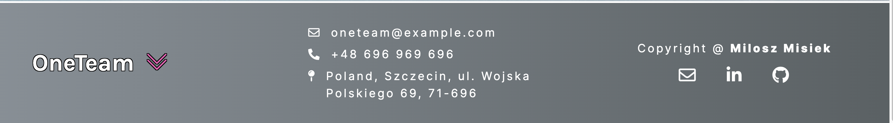
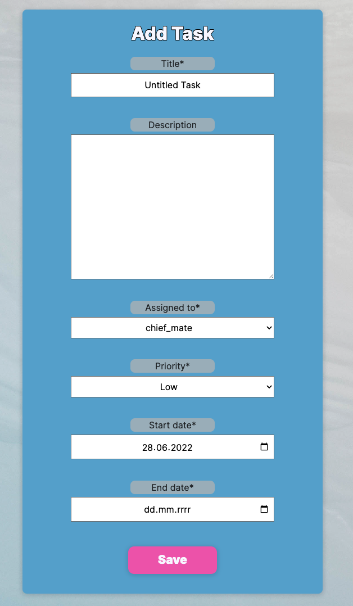
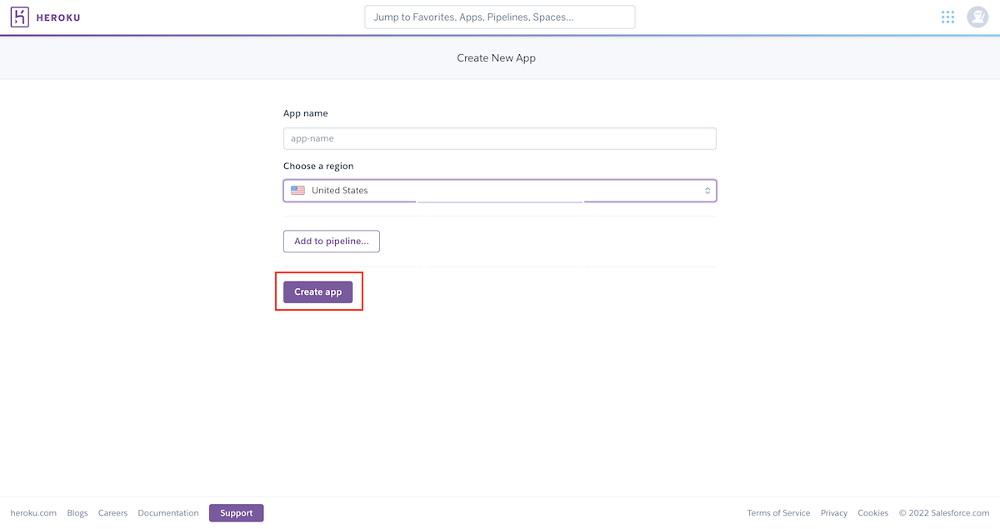

  # OneTeam
  ## **Contents**
  - [**About**](#about)
  - [**User Experience Design**](#user-experience-design)
    - [Strategy](#strategy)
    - [Target Audience](#target-audience)
    - [User Stories](#user-stories)
  - [**Technologies Used**](#technologies-used)
  - [**Features**](#features)
    - [User Rights](#user-rights)
    - [Tasks Home page](#tasks-home-page)
    - [Change Rank Procedure With Use Of Admin Panel](#change-rank-procedure-with-use-of-admin-panel)
  - [**Design**](#design)
    - [Color Scheme](#color-scheme)
    - [Typography](#typography)
    - [Wireframes](#wireframes)
  - [**Flowcharts**](#flowcharts)
  - [**Information Architecture**](#information-architecture)
    - [Database](#database)
    - [Entity-Relationship Diagram](#entity-relationship-diagram)
    - [Data Modeling](#data-modeling)
- [**Testing**](#testing)
- [**Deployment**](#deployment)
  - [Using Heroku to deploy the project](#using-heroku-to-deploy-the-project)
  - [Fork a repository](#fork-a-repository)
  - [Clone a repository](#clone-a-repository)
- [**Credits**](#credits)
- [**Acknowledgments**](#acknowledgments)


## About
[OneTeam app](https://ci-pp4-one--team.herokuapp.com/) is a ship's crew task manager. The goal of the app is to help ship's staff to manage their tasks, schedule jobs and keep track of necessary activities onboard vessels. It aims to increase productivity along with workers.

The live site can be found [here](https://ci-pp4-one--team.herokuapp.com/).

## User Experience Design
### Strategy
This app is designed to serve the ship's staff. The app is meant to be intuitive and of simple design. It is achieved by the use of a simple interface with toned colours.

### Target Audience
OneTeam is developed for ship members.
- **Master:** ship's master is meant to be the admin of the app and have full control over the workflow. He has access to the admin panel where he has overall responsibility for people and tasks.
- **Senior Officer:** the head of the Deck Department, second in command of the vessel, has the right to schedule jobs for crew with certain limitations.
- **Junior Officer:** under the direct command of Senior Officer. They can manage their tasks to keep track of their Division of Labour.
- **Bosun:** the most senior among ratings (regular workers). He can use the app to have an overview of what is planned to do and brief ordinary seamen about what management has planned to do.

### User Stories

**Master Goals**
| Issue ID    | User Story |
|-------------|-------------|
|[#3](https://github.com/miloszmisiek/ci-pp4-one_team/issues/3)|As a Master I can approve priority 1 tasks so that I have control over high-importance tasks being scheduled|
|[#4](https://github.com/miloszmisiek/ci-pp4-one_team/issues/4)|As a Master I can decide on a new user request so that the app functionality is restricted based on rank|

**Senior Officer Goals**
| Issue ID    | User Story |
|-------------|-------------|
|[#6](https://github.com/miloszmisiek/ci-pp4-one_team/issues/6)|As a Senior Officer, I can approve priority 2 and 3 tasks for Junior Officers so that I can control the workload for Junior Officers|
|[#26](https://github.com/miloszmisiek/ci-pp4-one_team/issues/26)|As a Senior Officer I can add tasks with Priority Low and Medium without Approval so that the Master does not need to approve all tasks which are of lower importance|

**User Goals**
| Issue ID    | User Story |
|-------------|-------------|
|[#1](https://github.com/miloszmisiek/ci-pp4-one_team/issues/1)|As a user I can explore home page information so that I know what the idea behind the app is|
|[#2](https://github.com/miloszmisiek/ci-pp4-one_team/issues/2)|As a user I can explore site functionality so that I will use its full potential |
|[#14](https://github.com/miloszmisiek/ci-pp4-one_team/issues/14)|As a user I can see the tasks period so that I know how to manage my time effectively|
|[#15](https://github.com/miloszmisiek/ci-pp4-one_team/issues/15)|As a user I can filter tasks for a specific month so that I can plan my work in a long-term|
|[#16](https://github.com/miloszmisiek/ci-pp4-one_team/issues/16)|As a user I can see task priority so that I know which tasks are of higher importance|
|[#17](https://github.com/miloszmisiek/ci-pp4-one_team/issues/17)|As a user I can see essential and clear tasks data so that I have quick access to necessary task information|
|[#18](https://github.com/miloszmisiek/ci-pp4-one_team/issues/18)|As a user, I can see today's date so that **I can plan which tasks are closer to their deadlines **|
|[#19](https://github.com/miloszmisiek/ci-pp4-one_team/issues/19)|As a user I can reset my password so that my password is restored when I forgot it or in case of a security breach|
|[#20](https://github.com/miloszmisiek/ci-pp4-one_team/issues/20)|As a user I can edit my account so that I can update my personal data if required|
|[#21](https://github.com/miloszmisiek/ci-pp4-one_team/issues/21)|As a user I can delete my account so that I can remove my profile from the app database|
|[#22](https://github.com/miloszmisiek/ci-pp4-one_team/issues/22)|As a user I can sign up and create my profile so that I have access to app functionality accordingly|
|[#23](https://github.com/miloszmisiek/ci-pp4-one_team/issues/23)|As a user I can sort tasks by table headings so that I will have my screen organized|
|[#24](https://github.com/miloszmisiek/ci-pp4-one_team/issues/24)|As a user I can see task details so that I have a better understanding of the work scope|
|[#25](https://github.com/miloszmisiek/ci-pp4-one_team/issues/25)|As a registered user I can see my dashboard with tasks as a home page so that I don't have to navigate throughout the app to see it|

**Combined Goals**
| Issue ID    | User Story |
|-------------|-------------|
|[#5](https://github.com/miloszmisiek/ci-pp4-one_team/issues/5)|As a task approval responsible person I can see clearly which task is new so that I can effectively review and approve the task if required|
|[#7](https://github.com/miloszmisiek/ci-pp4-one_team/issues/7)|As an officers member I can change tasks status so that it is clear what tasks are left to do|
|[#8](https://github.com/miloszmisiek/ci-pp4-one_team/issues/8)|As a task creator I can set task priority so that it is clear for all users how to prioritize their work|
|[#9](https://github.com/miloszmisiek/ci-pp4-one_team/issues/9)|As a task creator I can set task duration so that it is clearly stated what is planned time for a task completion|
|[#10](https://github.com/miloszmisiek/ci-pp4-one_team/issues/10)|As an Officer/Chief Mate I can see if the task is approved so that I can proceed with a planned job or delegate the task to Bosun|
|[#11](https://github.com/miloszmisiek/ci-pp4-one_team/issues/11)|As an Officer/ a Chief Mate/Master I can add new tasks so that schedule my work in an organized manner|
|[#12](https://github.com/miloszmisiek/ci-pp4-one_team/issues/12)|As a Bosun or Officer, I can see only tasks assigned to my rank so that I don't clutter my task manager with irrelevant tasks|
|[#13](https://github.com/miloszmisiek/ci-pp4-one_team/issues/13)|As a Bosun, I can see only approved tasks so that I have a clear picture of what should be done by the crew|

[Back to contents](#contents)

---
## Technologies Used
- ### Languages
    + [Python 3.9.12](https://www.python.org/downloads/release/python-3912/): the primary language used to develop the server-side of the website.
    + [JS](https://www.javascript.com/): the primary language used to develop interactive components of the website.
    + [HTML](https://developer.mozilla.org/en-US/docs/Web/HTML): the markup language used to create the website.
    + [CSS](https://developer.mozilla.org/en-US/docs/Web/css): the styling language used to style the website.
- ### Frameworks and libraries:
    + [Django](https://www.djangoproject.com/): python framework used to create all the logic.
    + [jQuery](https://jquery.com/): was used to control click events and sending AJAX requests.
    + [Bootstrap](https://getbootstrap.com/): was used as a supprotive toolkit for front-end styling.
- ### Databases:
    + [SQLite](https://www.sqlite.org/): was used as a development database.
    + [PostgreSQL](https://www.postgresql.org/): the database used to store all the data.

- ### Other tools:
    + [Git](https://git-scm.com/): the version control system used to manage the code.
    + [Pipenv](https://pypi.org/project/pipenv/): the package manager used to install the dependencies. Pipenv combines using `pip` and `virtualenv` - they work togehter as `pipenv`.
    + [Gunicorn](https://gunicorn.org/): the webserver used to run the website.
    + [Spycopg2](https://www.python.org/dev/peps/pep-0249/): the database driver used to connect to the database.
    + [Django-allauth](https://django-allauth.readthedocs.io/en/latest/): the authentication library used to create the user accounts.
    + [Django-crispy-forms](https://django-cryptography.readthedocs.io/en/latest/): was used to control the rendering behavior of Django forms.
    + [Heroku](https://dashboard.heroku.com/): the hosting service used to host the website.
    + [GitHub](https://github.com/): used to host the website's source code.
    + [VSCode](https://code.visualstudio.com/): the IDE used to develop the website.
    + [Chrome DevTools](https://developer.chrome.com/docs/devtools/open/): was used to debug the website.
    + [Font Awesome](https://fontawesome.com/): was used to create the icons used in the website.
    + [Draw.io](https://www.lucidchart.com/) was used to make a flowchart for the README file.
    + [W3C Validator](https://validator.w3.org/): was used to validate HTML5 code for the website.
    + [W3C CSS validator](https://jigsaw.w3.org/css-validator/): was used to validate CSS code for the website.
    + [JShint](https://jshint.com/): was used to validate JS code for the website.
    + [PEP8](https://pep8.org/): was used to validate Python code for the website.
    + [Django-session-security](https://django-session-security.readthedocs.io/en/master/index.html): was used to handlw automatic logout after inactivity and browser close
    + [Coolorc.co](https://coolors.co/): was used to choose pallete colors for website
    + [CSSgradient.io](https://cssgradient.io/): was used for genertating background gradients
    + [Grammarly](https://www.grammarly.com/): was used to check grammar and typo errors.

[Back to contents](#contents)

---
## Features

OneTeam is built with the following components:
- landing page (home page for logout users)
- tasks home page (logged-in users)
- login page
- registration page
- logout page
- edit the profile page
- change the password page
- account inactive page
- confirm the email page
- reset the password page
- add task page
- edit the task page
- user's dashboard page
- no permission page

[Back to contents](#contents)
### User Rights
| Feature     | Master  | Senior Officer    | Junior Officer | Bosun |
| ------------- | ------------- | ------------- | ---------- | ------------- |
| landing page                   | Y | Y | Y | Y |
| tasks home page                  | Y | Y | Y | Y | 
| registration page           | Y | Y | Y | Y | 
| logout page                 | Y | Y | Y | Y | 
| edit profile page           | Y | Y | Y | Y | 
| delete profile         | Y | Y |Y | Y | 
| delete other members         | Y (admin panel) | N |N | N |
| change password page        | Y | Y | Y | Y | 
| change rank = account inactive                | N | Y | Y | Y |
| confirm email page       | Y | Y | Y | Y |
| reset password page     | Y  | Y | Y | Y |
| add task page     | Y | Y| Y | N| 
| assign users for task     | Y | Y (except Master| N | N|
| approve tasks     | Y | Y (Priority Medium and Low) | N| N|
| change tasks status | Y | Y | Y (only assigned to a user) | N|
| delete tasks *(except status Waiting for approval)* | Y | Y | Y (only assigned to a user) | N|
| edit task page                   |Y | Y| Y | N|
| user's dashboard page               |Y | Y| Y | Y|
| no permission page              |N | Y| Y | Y|

**Navbar**


Navbar is structured with:
- **Logo** to the left (redirects to home page)
- **Home** page button
- **Menu** dropdown

  *Logout Users*
  - Registration link
  - Login link
  
  *Logged In Users*
  - My profile link (user's dashboard)
  - Logout link

Simplistic design without many features to focus the user's on major components of the app.

[Back to contents](#contents)

**Footer**



Footer is structured with:
- **Logo** to the left (not-redirect to the home page)
- **Contact** information to the OneTeam owners (dummy data at the moment)
- **Copyright** section for the creator with links

Footer was designed to contain necessary contact information related to the app and to be easily identified.

[Back to contents](#contents)

**Landing page**


The landing page is structured with:
- **Hero** section contains the logo, the main goal of the app and the **Get Started** button which redirects to the registration site
- **Mission** section with marine theme photos and a short goal description 
- **Final word** section to encourage users to register with the repeated **Get Started** button

[Back to contents](#contents)

**Sign Up page (registration)**


Sign Up form is based on an all-auth package template with custom styling.

All fields are required to create an account.

Sign up page is structured with:
- **Head title** with **sign in** link and instructions
- **Email address** field
- **Confirm email** field
- **Username** field (must be unique)
- **First Name** field
- **Last Name** field
- **Select Your Rank** field *(Note: default is Bosun for model convenience, but users cannot leave a blank field, they must select one rank)*
- **Password** field
- **Confirm Password** field
- **Sign Up** button which submits the form if a form is valid

[Back to contents](#contents)

**Sign In page (login)**


Sign In form is based on an all-auth package template with custom styling.

Sign In page is structured with:
- **Head title** with **sign up** link and instructions
- **Email or Username** field - users can use both to log in
- **Confirm email** field
- **Password** field
- **Remember Me** checkbox which controls the lifetime of the session - allows users to remain logged in on browser close
- **Forgot Password** link redirects to the **Password Reset** page
- **Sign In** button submits the form and redirects the user to the tasks home page

[Back to contents](#contents)

**Sing Out page (logout)**


Sign Out form is based on an all-auth package template with custom styling.

Sign Out page is structured with:
- **Confirmation** message for user if his request is valid (defensive programming)
- **Sign Out** button which submits the form and redirects the user to a landing page

[Back to contents](#contents)

**Password Reset page**


Password Reset form is based on an all-auth package template with custom styling.

Password Reset page is structured with:
- **Description** message for the user on how to proceed with the request
- **Email address** field to type in the user's email address used for registration in order to send the link to reset the password
- **Reset Password** button which submits the form and redirects the user password reset completed page

[Back to contents](#contents)
### Tasks Home page 


Tasks Home page is structured with:
- **Hello** message for the user which reflects on the user's first name and rank.
- **Selections** section:
  - *What's Next* message with anchor icon to reflect on what is the purpose of this page - show users what are valid tasks onboard the ship
  - *Select Month* menu - user can choose the month and the app will render tasks related to the month selected with two options:
    - Tasks with Start Date matching the selection
    - Tasks with End Date matching the selection
  - *Today is* message that informs the user what is today's date
- **Add Task** button which redirects to add task page.
- ### Tasks Table 
  All users have an overview of all valid tasks on the home page. Users can sort the tasks by columns - the header click event triggers the sorting function. The table is separated by the following columns:
  - **ID** - this id **IS NOT** the primary key of the model Task. It is a for loop counter which represents all the tasks rendered in the templated with *End Date* ascending order as default.
  - **Status** column which identifies tasks status Scheduled, Completed - represented with font awesome icon, or Overdue.
    - The program sets tasks to Overdue automatically after the *End Date* of the task exceeds the present date. Status can be changed with a user click event on the table cell with certain limitations (see [User Rights](#user-rights)).
    - When a user is permitted to change status, click event opens modal with a message to the user to change task status accordingly to the present state.
  
      

  - **Owner** column represents who is assigned to a task by the Rank.
    - When hovered over user can see the username of the assigned person.
  
      

  - **Priority** text representation of task priority: High, Medium or Low. 
  - **Title** represents the task's title. When clicked it opens a modal with *Task Details*.
    - *Task Details* modal contains detailed information including all the dates related to the task and gives the user ability to **Edit Task** or **Delete Task** if allowed (see [User Rights](#user-rights)).
    
      

  - **End Date** column represents the date specified by the task creator to complete the task. It's the default for table sorting when the home page is rendered. **Overdue** tasks are highlighted with Font Awesome exclamation icon to get the user's attention. Tasks close to reaching *End Date* (2 days in advance) are highlighted with Font Awesome triangle exclamation icon.

    
  
  - **Approval** column represents the task approval set by the task's creator: Approved, Waiting for approval and N/R (Not Required). Users with appropriate permission can approve tasks if required (see [User Rights](#user-rights)). If the task can be approved the green button is rendered to Approve the task. If users would like to change its status backwards (Waiting for approval) they can do it by clicking on the cell (with required [User Rights](#user-rights))).

    

    - **N/R** approval status is set automatically for all tasks created by Master or for Priority Medium or Low tasks created by Chief Mate.
    - All **Priority High** tasks must be approved only by **Master**


[Back to contents](#contents)

**Hide Completed** button section - gives the user the ability to remove temporarily tasks marked as Completed.
  - *Note*: the app automatically filters tasks which are Completed and have not been updated for 2 days.

  
<br>
<br>

All users has almost identical page layout. The elements that change are:
- **Hello** section - updates with current user name and rank
- **Add Task** button - not visible for user with rank of *Bosun*
- **Approve** button - visible only for users with appropriate rights (see [User Rights](#user-rights))
- **Status Modal** - visible only for users with appropriate rights (see [User Rights](#user-rights))
- **Edit Task** and **Delete Task** buttons in **Details Modal** - visible only for users with appropriate rights (see [User Rights](#user-rights))

[Back to contents](#contents)

**My Profile/Dashboard**


Every user has access to his private dashboard which consists of:
- **Dashboard** message for the current user
- **Selections** section:
  - *Account* subsection - gives the user ability to edit and delete his account.
    - Edit Button redirects to the Edit Profile page
    - Delete Button allows users to permanently delete their accounts - the user must confirm his choice in the browser's built-in confirm box.
      
      
  
  - *Select Month* menu (same as [Tasks Home Page](#tasks-home-page))
  - *Today is* message (same as [Tasks Home Page](#tasks-home-page))

- **Add Task** button (same as [Tasks Home Page](#tasks-home-page))

- **My Profile Tasks Page**
  The functionality is exactly the same as in [Tasks Home Table](#tasks-table). The difference is that here users can see only tasks which are assigned specifically to their user.

**Hide Completed** button section - (same as [Tasks Home Page](#tasks-home-page)) 

[Back to contents](#contents)

<br>

**Add Task** page renders custom Add Task form which contains:
- *Title* - default value is "Untitled Task", the field required to submit the form
- *Description* - users can write their comments on what has to be done, job specifications or any other relevant information
- *Assigned to* - dropdown list of available users with the default value set to the current user, the field required to submit the form
- *Priority* - dropdown list with priority selection. The default value is set to Low, the field required to submit the form.
- *Start Date* - date field to select or type the date to start the job, the field required to submit the form
- *End Date* - date field to select or type the date to finish the job, the field required to submit the form



  
  *Notes*:
  - The end date cannot be set before the Start Date.
  - Users are allowed to set Start Date and End Date with past dates for jobs that happened and must be documented.
  - All fields are validated for correct input.


[Back to contents](#contents)

**Edit Task** layout is exactly the same as the **Add Task** page. The form is prefilled with a task that users choose to edit.


**Edit Profile** page renders a custom Edit Task form which contains and allows users to edit the following data:
- *First Name* field
- *Last Name* field
- *Email* field
- *Rank* selection field
- *Change Password* link - redirects to **Change Password** page
- *Save* button - redirects back to the **My Profile** page

  

  *Notes*:
  - Every Rank update must be approved by the Master - when the user decides to update his rank and submit the form his account will be set to inactive and only the Master (admin) can activate his account again from the admin panel. This is to brought to avoid any disapproved rank changes.
  - Before the user submits the form he must confirm his decision in the browser's confirmation box.

      

  - Below the Rank selection field message on the yellow background warns the user of the rank change consequences.

[Back to contents](#contents)

### Change Rank Procedure With Use Of Admin Panel
When new users create their accounts or when existing users edit their profiles with new ranks, the profile will be deactivated and the Master (or other admin) will have to set the account back to active using the Django admin panel.
1. Open the admin panel by typing `https://ci-pp4-one--team.herokuapp.com/admin` in your browser's URL bar.
2. Type in your admin login and password and press the `Login` button.

    

3. Navigate to the **Custom users** section.

    
4. Locate the user with the **Active** field represented with a red cross.
5. Select the user by clicking on the select field next to his **First Name**.
6. Navigate to the **Action** bar, select *Activate user account* and click `Go`.
7. User **Active** status should be represented with a green check mark.

    


**Change Password page**


Password Change form is based on an all-auth package template with custom styling. All fields are validated for correct entries.

Password Change page is structured with:
- **Current Password** field - users must type in their current password
- **New Password** field
- **New Password (again)** - users must confirm their New Password, both must match to proceed with submission
- **Change Password** button - submits the form and redirects the user to the **Edit Profile** page on successful completion

[Back to contents](#contents)
## Design
The main theme of the application is designed to be toned, thus it gives a great contrast with elements of brighter colours requiring attention. The principle of the design is to bring a minimalistic approach to the page.
### Color Scheme
The colour scheme is based on pastel colours with the use of bold colours to bring the user's attention.

[Back to contents](#contents)
### Typography
The primary font used for the application is Inter. Logo and big headings use Karla font. Together they give great contrast but also transition smoothly between one another. All fonts come from [Google Fonts](https://fonts.google.com/).

[Back to contents](#contents)

### Wireframes
 Wireframes used in the design process can be found [here](documentation/wireframes/one-team-wireframes.pdf). The deployed version of the site is not the exact representation of the wireframes due to time management or technical issues.

 [Back to contents](#contents)

 ---
 ## Flowcharts
 During the design process, the flowcharts helped to visualize the different user roles and respective functionality. The deployed version of the site might differ from the planned flowcharts due to time management or technical issues. Flowcharts can be found below:
 - [Master](documentation/flowcharts/master.png)
 - [Senior Officer](documentation/flowcharts/chief-mate.png)
 - [Junior Officer](documentation/flowcharts/junior-officer.png)
 - [Bosun](#)

[Back to contents](#contents)

---
## Information Architecture
### Database
- The deployed version of the application uses PostgreSQL as a database.
- SQLite was used for Django automated unit tests.

### Entity-Relationship Diagram
 - The ERD was created using [draw.io](draw.io).
 - The ERD can be found [here](documentation/data-modeling/oneteam-erd.pdf). 

### Data Modeling
1. **CustomUser**
  
  Created as a subclass of Django AbstractUser.

   Name          | Database Key  | Field Type    | Validation |
| ------------- | ------------- | ------------- | ---------- |
| Username      | username      | CharField     |  max_length=50, blank=False, null=True, unique=True    |
| Email         | email         | EmailField    | max_length=50, unique=True, blank=False, null=False    |
| First Name    | first_name    | CharField     | max_length=30, blank=False, null=False    |
| Last Name     | last_name     | CharField     | max_length=30, blank=False, null=False    |
| Rank          | rank         | IntegerField  | choices=ROLES, blank=False, null=False, default=3    |

```Python
    # Roles to assign to users
    ROLES = [
        (0, 'Master'),
        (1, 'Senior Officer'),
        (2, 'Junior Officer'),
        (3, 'Bosun'),
    ]
```

2. **Task**

  Designed as a custom model inheriting from Django models.Model. This model is a core data structure for the application and is used to organize tasks created by users.
  
   Name          | Database Key  | Field Type    | Validation |
| ------------- | ------------- | ------------- | ---------- |
| Title      | title      | CharField     |  max_length=35, blank=False, default='Untitled Task    |
| Description         | email         | TextField    | max_length=300, blank=True    |
| Status    | status    | IntegerField     | choices=TASK_STATUS, default=0    |
| Created By     | created_by     | ForeignKey     | CustomUser, on_delete=models.CASCADE, related_name='task_creator', null=True    |
| Assigned To          | assigned_to         | ForeignKey  | CustomUser, on_delete=models.CASCADE, blank=True, null=True, related_name='task_owner'    |
| Priority          | priority         | IntegerField  | cchoices=TASK_PRIORITY, default=2    |
| Approval Status          | approval_status         | IntegerField  | choices=TASK_APPROVAL, default=1    |
| Created On          | created_on         | DateField  | cauto_now_add=True    |
| Updated On          | updated_on         | DateField  | auto_now=True    |
| Start Date         | start_date         | DateField  | default=datetime.date.today    |
| End Date         | end_date         | DateField  | null=True    |


```Python
# task model variables

TASK_STATUS = (
    (0, 'Scheduled'),
    (1, 'Completed'),
    (2, 'Overdue'),
)

TASK_PRIORITY = (
    (0, 'High'),
    (1, 'Medium'),
    (2, 'Low'),
)

TASK_APPROVAL = (
    (0, 'Approved'),
    (1, 'Waiting For Approval'),
    (2, 'N/R'),
)
```

[Back to contents](#contents)

# Testing
Various test results are presented in separate [TESTING](TESTING.md) files.

[Back to contents](#contents)


# Deployment
## Using Heroku to deploy the project
- Setup of the local workspace:
  - This project was developed with the use of [pipenv](https://pypi.org/project/pipenv/) to handle all dependencies
  - Managing a `requirements.txt` file can be problematic, so Pipenv uses the upcoming `Pipfile` and `Pipfile.lock` instead, which is superior for basic use cases.
  - Create a `Procfile` in the local workspace and type in `web: gunicorn <name app>.wsgi:application` inside the file.
  - Commit and push to GitHub

This project was deployed using [Heroku](https://dashboard.heroku.com/) using the following steps:

1. Click on *New* in the top-right corner and then *Create New App*.


2. On the next page give the app the unique name.
3. Choose a region (the USA or Europe).
4. Click *Create app*.



5. Go to the *Resources* tab and search for PostgreSQL. Select *Hobby dev - Free* and click on the provision button to add it to the project


6. On the next page click on the *Settings* tab.
7. In the Settings page open *Config Vars* and add the following:


7. Copy the value of *DATABASE_URL* and paste it into your `.env` file in your workspace together with your secret key.
   - This application uses [Gmail](https://www.google.com/intl/pl/gmail/about/) as an email SMTP server. This requires adding following variables to the project's `settings.py` file:
      - `EMAIL_USE_TLS = True`
      - `EMAIL_PORT = 587`
      - `EMAIL_HOST = 'smtp.gmail.com'`
      - `EMAIL_HOST_USER = 'your_account@gmail.com' `
      - `EMAIL_HOST_PASSWORD = 'yourGmailPassword'`
  
    - For **Heroku** deployment add folowing values to *Config Vars*:
      - `EMAIL_HOST_USER = 'your_account@gmail.com' `
      - `EMAIL_HOST_PASSWORD = 'yourGmailPassword'`

8. Set `DEBUG = False` in `settings.py`.
9. Commit and push your changes to GitHub.
10. Click on the *Deploy* tab.
11. In the *Deploy* page in the *Deployment Method* select GitHub.
12.  After a successful connection to GitHub locate your repository and add it to Heroku.

  

13. In the *Manual Deploy* section confirm that *main* branch is selected and click *Deploy Branch*
14. For Final Deployment confirm `DEBUG = False` in `settings.py` and delete `DISABLE_COLLECTSTATIC` from *Config Vars* in **Heroku**.
15. Commit and push changes to GitHub.


[Back to contents](#contents)

## Fork a repository
A fork is a copy of a repository. Forking a repository allows you to freely experiment with changes without affecting the original project. The steps are as follows:
1. On GitHub.com navigate to the repository page.
2. In the top-right corner of the page, click **Fork**.


You can fork a repository to create a copy of the repository and make changes without affecting the upstream repository.
## Clone a repository
In GitHub, you have the option to create a local copy (clone) of your repository on your device's hard drive. The steps are as follows:
1. On GitHub.com navigate to the repository page.
2. Locate the *Code* tab and click on it.
3. In the expanded window, click the two squares icon to copy the HTTPS link of the repository.


4. On your computer, open **Terminal**.
5. Navigate to the directory of choice.
6. Type **git clone** and paste the copied link of the repository.
7. Press **Enter** and the local clone of the repository will be created in the selected directory.

[Back to contents](#contents)

## Credits
1. Models are based on the project [Issue Tracker](https://github.com/IuliiaKonovalova/issue_tracker) created by my good friends [Juliia Konovalova](https://github.com/IuliiaKonovalova) and [Aleksei Konovalov](https://github.com/lexach91).
2. Inspiration for selected views and README file comes from the project [Cool School](https://github.com/IuliiaKonovalova/school_app) by [Juliia Konovalova](https://github.com/IuliiaKonovalova).
3. Fixed bug with static files directory from [Stack Overflow](https://stackoverflow.com/questions/67698211/getting-get-static-css-base-css-http-1-1-404-1795-error-for-static-files)
4. Tables styling comes from [css-tricks.com](https://css-tricks.com/responsive-data-tables/)
5. Sorting function used in tables comes from [W3Schools](https://www.w3schools.com/howto/howto_js_sort_table.asp)
6. SelectWithDisabled widget comes from [djangosnippets](https://djangosnippets.org/snippets/2453/)
7. Favicon generated using [favicon.cc](https://www.favicon.cc/)
8. Scroll on the top button comes from [W3Schools](https://www.w3schools.com/howto/howto_js_scroll_to_top.asp)
9. Header, footer and dropdown background was copied from [SheCodes](https://gradients.shecodes.io/gradients/825).

[Back to contents](#contents)

## Acknowledgments
1. My girlfriend for being my biggest supporter throughout the entire time!
2. A very big thanks to my friends [Juliia Konovalova](https://github.com/IuliiaKonovalova) and [Aleksei Konovalov](https://github.com/lexach91) for all the help, guidance and sharing their experience with me. You guys are the best!
3. My mentor [Samantha Dartnall](https://www.linkedin.com/in/samantha-dartnall/) for guidance and support on the project. 

[Back to contents](#contents)

Copyright @ Milosz Misiek 2022