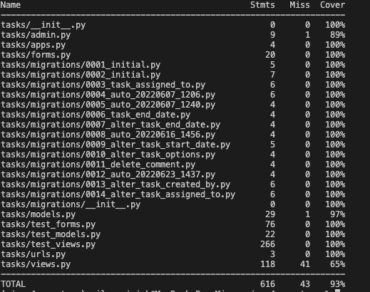
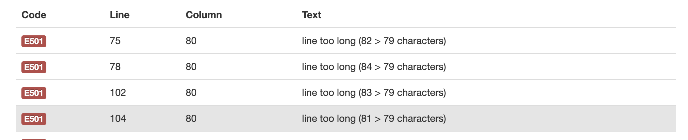
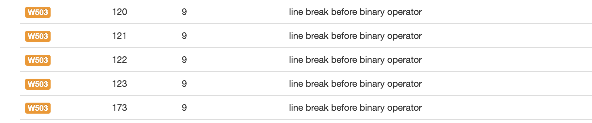
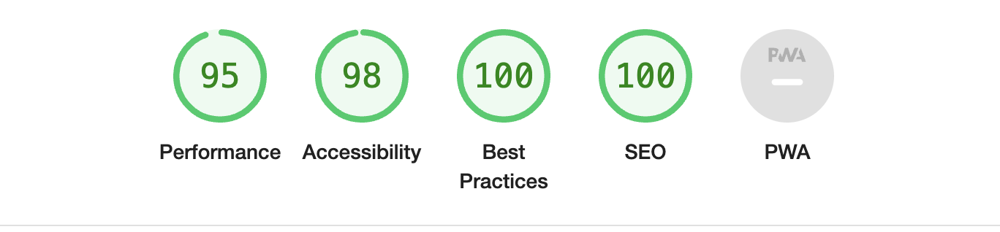
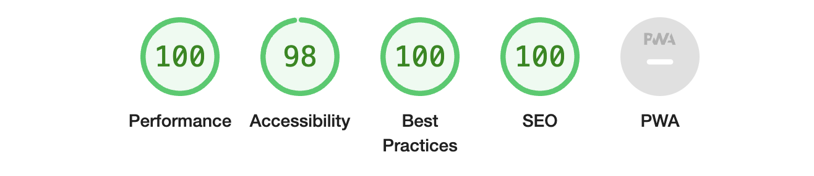
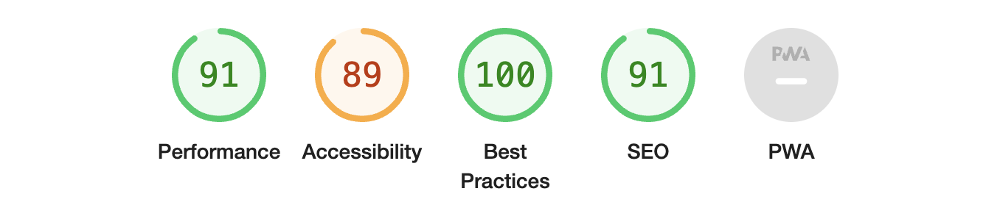
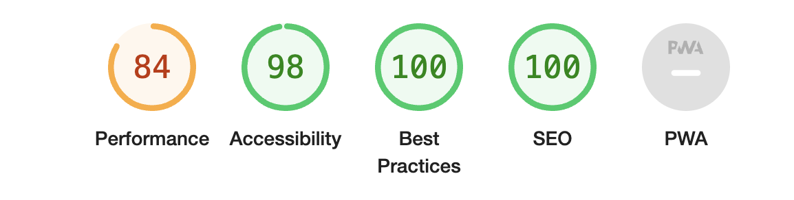
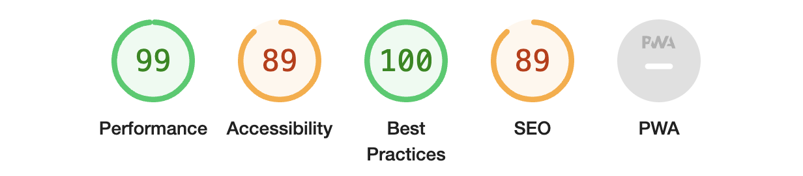
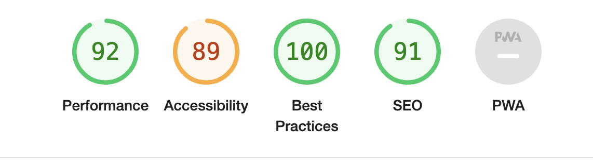

# Testing

## Contents
  - [Manual Testing](#manual-testing)
  - [Testing User Story](#testing-user-story)
  - [Bugs](#bugs)
  - [Automated Teststing](#automated-teststing)
    - [Users Coverage](#users-coverage)
    - [Tasks Coverage](#tasks-coverage)
  - [Validation:](#validation)
    - [HTML Validation:](#html-validation)
    - [CSS Validation:](#css-validation)
    - [JS Validation:](#js-validation)
    - [Python Validation:](#python-validation)
  - [Lighthouse Reports](#lighthouse-reports)

## Manual Testing

Where automated unit testing was not completed or where extra testing was required to ensure proper functionality, the use of manual testing was implemented. The actions and results are listed below.

|     | User Actions           | Expected Results | Y/N | Comments    |
|-------------|------------------------|------------------|------|-------------|
| **Sign Up**     |                        |                  |      |             |
| 1           | Click on the Get started button | Redirection to signup page | Y |          |
| 2           | Click on the Menu button and Register link | Redirection to signup page | Y |          |
| 3           | Form fields format validation | Correct input format required from user | Y |          |
| 4           | Submit signup with blank fields | Form validation triggered, highlight the field, submission aborted | Y |          |
| 5           | Submit signup with correct values | Account Inactive site displayed | Y |      Email send/receive tested with real email account    |
| 6           | Sign in link in the header message | Redirects to login page | Y |          |
| **Sign In**     |                        |                  |      |             |
| 1           | Click on the Menu button and Login link | Redirection to login page | Y |          |
| 2           | Click on the Sign-Up link in the header message | Redirection to signup page | Y |          |
| 3           | Type in a valid username or email with the password for the login and submit button| Redirection to tasks home page  | Y |          |
| 4           | Type in the invalid username or email with the password for the login and submit button | Validation message appears | Y |          |
| 5           | Type in a valid username or email with the password for the login and submit button - account active, email address not confirmed| Redirection to confirm your email page  | Y |          |
| 6           | Type in a valid username or email with the password for login and submit button - account inactive| Redirection to Account Inactive page  | Y |          |
| 7           | Sing-In with Remember Me selected  | Remain logged in on browser close | Y |          |
| 8           | Sign In with Remember me unselected  | User logged out on browser close | Y         | |
| 9           | Click Forgot Password link | Redirection to Rest Password page  | Y |          |
| **Rest Password**     |                        |                  |      |             |
| 1           | Type in correct email and press Rest Passwrod| Redirection to Password Rest done page | Y |   Tested with real email account       |
| 2           | Type in incorrect email and press Reset Password | Validation message appears to inform the user of incorrect email | Y |          |
| 3           | Press Reset Password with blank email field | Form validation triggered, submission aborted | Y |          |
| **Tasks Home Page**     |                        |                  |      |             |
| 1           | User logs in | Hello message with current user's first name and rank below | Y |        |
| 2           | User logs in | Today is section represents today's date. Tasks sorted by end date ascending. Arrow showing down. | Y |        |
| 3           | Click Select Month and choose a month from the dropdown menu | Page refresh with tasks Start Date and End Date matching user's month selection | Y |        |
| 4           | Bosun logs in | Add Task button hidden | Y |        |
| 5           | Junior logs in | Add Task button visible | Y |        |
| 6           | Senior logs in | Add Task button visible | Y |        |
| 7           | Master logs in | Add Task button visible | Y |        |
| 8           | User clicks Add Task | Redirects to Add Task page | Y |        |
| 9           | User clicks Hide Completed button | Page refresh and with completed tasks excluded. | Y |        |
| **Table Functionality**     |                        |                  |      |             |
| 1           | User clicks table headings | Tasks sorted ascending/descending with respective heading clicked. Arrow changes on ascending down and on descending up | Y |        |
| 2           | Bosun clicks Scheduled cell | Nothing happens | Y |        |
| 3           | Junior clicks Scheduled cell for the task assigned to his user | Change Status modal appears with change to complete message | Y |        |
| 4           | Junior clicks Overdue cell for the task assigned to a different user | Nothing happens | Y |        |
| 4           | Junior clicks Scheduled cell for the task assigned to a different user | Nothing happens | Y |        |
| 5           | Senior clicks Scheduled cell for any user's (except Master) task assigned to | Change Status modal appears with change to complete message | Y |        |
| 6           | Senior clicks Overdue cell for any user's (except Master) task assigned to | Change Status modal appears with change to complete message | Y |        |
| 7           | Senior clicks Scheduled cell for the task assigned to Master | Nothing happens | Y |        |
| 8           | Senior clicks Overdue cell for the task assigned to Master | Nothing happens | Y |        |
| 9           | Senior clicks task's title cell assigned to Master | Task Details modal appears, but Edit and Delete buttons are not visible | Y |        |
| 10           | Senior clicks task's title cell assigned to any user (except Master) | Task Details modal appears with Edit and Delete buttons | Y |        |
| 11           | Senior clicks Approve button for permitted tasks | Task Approval Status changes to Approved | Y |        |
| 12           | Senior clicks Approved button for permitted tasks  |  Task Approval Status changes to Waiting for approval | Y |    For Senior and Master Approve button appears    |
| 13           | Master clicks Scheduled cell for any user | Change Status modal appears with change to complete message | Y |        |
| 14           | Master clicks Overdue cell for any user | Change Status modal appears with change to complete message | Y |        |
| 15           | Master clicks task's title cell assigned to any user | Task Details modal appears with Edit and Delete buttons | Y |        |
| 16           | Master clicks Approve button for any task | Task Approval Status changes to Approved | Y |        |
| 17           | Senior clicks Approved button for any task  |  Task Approval Status changes to Waiting for approval | Y |    For Senior and Master Approve button appears    |
| 18           | Any valid user logs in |  Tasks Waiting for approval are highlighted | Y |      |
| 19           | Junior user logs in |  Tasks Waiting for approval are displayed as text with small clock Font Awesome icon | Y |      |
| 20           | Bosun user logs in |  Tasks Waiting for approval are displayed as text with small clock Font Awesome icon | Y |      |
| 21           | User opens Tasks Home page |  Task rows content with End Date less than today are in red colour. The exclamation mark is displayed next to tasks End Date content  | Y |      |
| 22           | User opens Tasks Home page |  Task rows content with End Date being reached in 2 days from current date are in brownish colour. A Triangle exclamation mark is displayed next to tasks End Date content. Task status changes to Overdue  | Y |      |
| 23           | User opens Tasks Home page |  Task rows content with End Date less than today are in red colour. The exclamation mark is displayed next to tasks End Date content  | Y |      |
| 24           | User clicks N/R approval status for any task |  Nothing happens  | Y |      |
| **Status Modal**     |                        |                  |      |             |
| 1           | Permitted user clicks Yes button for Modal triggered for task's Schedule status |  Task status is changed to Completed. The row content changes to green colour | Y |  Completed status is represented by Font Awesome circled check icon    |
| 2           | Permitted user clicks Yes button for Modal triggered for task's Completed status |  Task status is changed to Scheduled/Overdue. The row content changes to the default/red colour | Y |      |
| 3           | Permitted user clicks No button for Modal triggered for any task |  Redirects to Tasks Home page without any change  | Y |      |
| **Task Title Modal**     |                        |                  |      |             |
| 1           | Permitted users to click Edit button | Redirects to Edit Task page | Y |      |
| 2           | Permitted users click Delete button | Browser's confirm message appears to check user's decision | Y |      |
| 3           | Any user opening modal | Title, Description and details dates are visible | Y |      |
| **My Profile Page**     |                        |                  |      |             |
| 1           | User opens My Profile page | Account section is visible. Only tasks assigned to the user are displayed in the table. The top message reflects the current user's data | Y |      |
| 2           | User clicks Account Edit button | Redirects to Edit Profile page | Y |      |
| 3           | User clicks Account Delete button | Browser's confirm message appears to check user's decision | Y |      |
| 4           | User clicks Ok in Browser's confirm box | Account is deleted, redirects to landing page | Y |      |
| 5           | User clicks Cancel in Browser's confirm box | Redirects to previous page | Y |      |
| **Edit Profile Page**     |                        |                  |      |             |
| 1           | User opens Edit Profile page | Form is prefilled with current user data | Y |      |
| 2           | User clicks Submit button | Form is prefilled with current user data | Y |  Browser's confirm message appears to check user's decision    |
| 4           | User clicks Ok in Browser's confirm box without any changes | Redirects to My Profile page | Y |      |
| 5           | User clicks Cancel in Browser's confirm box | Redirects to Edit Profile page | Y |      |
| 6           | User clicks Ok in Browser's confirm box with any change except Rank | The fields are updated with user's new data | Y |      |
| 7           | User clicks Cancel in Browser's confirm box with any change except Rank | Redirects to Edit Profile page | Y |      |
| 8           | User clicks Ok in Browser's confirm box with Rank changed | Redirects to Account Inactive page as a profile is set to inactive. The profile can be set to active from the admin panel by Master | Y |   Rank change decision should be consulted first with the supervisor and he should be aware of this change   |
| 9           | User clicks Cancel in Browser's confirm box with Rank changed | Redirects to Edit Profile page | Y |      |
| **Change Password Page**     |                        |                  |      |             |
| 1           | User clicks Change Password button with blank fields | Form validation is triggered highlighting fields which are empty | Y |      |
| 2           | Typed in current password does not match with the password saved in database | The message is displayed informing a user of wrongly typed password | Y |      |
| 3           | New Password does not match the New Password (again) | The message is displayed informing a user of mismatched passwords| Y |      |
| 4           | User types correct values and presses Reset Password button | Redirects to Edit Profile page, the password is updated | Y |      |
| **Add Task Page**     |                        |                  |      |             |
| 1           | Junior opens Add Task page | Form is rendered, assigned to the field has only current's user username option available | Y |      |
| 2           | User opens Add Task page | Assigned to field default value is current user's username | Y |      |
| 3           | Junior submit the form with valid data | Redirects to Tasks Home page, a new task is added with approval status Waiting to be approved | Y |      |
| 4           | User submits a form with End Date before Start Date | Form validation is triggered, a message appears to inform the user of wrong entry | Y |      |
| 5           | Senior opens Add Task page | Form is rendered, assigned to the field has all users available except Master | Y |      |
| 6           | Senior submit the form with Priority Medium or Low | Redirects to Tasks Home page, a new task is added with approval status N/R (Not Required) | Y |      |
| 7           | Senior submit the form with Priority High | Redirects to Tasks Home page, a new task is added with approval status Waiting for approval | Y |      |
| 8           | Master opens Add Task page | Form is rendered, assigned to the field has all users available including Master | Y |      |
| 9           | Master submits the form with any Priority | Redirects to Tasks Home page, a new task is added with approval status N/R (Not Required) | Y |      |
| **Edit Task Page**     |                        |                  |      |             |
| 1           | Junior opens Edit Task page | Form is rendered, assigned to the field has only current's user username option available | Y |      |
| 2           | Junior submits the form for the task with N/R approval status | Redirects to Tasks Home page with task approval status Waiting for approval | Y |      |
| 2           | Junior submits the form for the task with N/R approval status | Redirects to Tasks Home page with task approval status Waiting for approval | Y |      |
| 4           | User submits a form with End Date before Start Date | Form validation is triggered, a message appears to inform the user of wrong entry | Y |      |
| 5           | Senior opens Edit Task page | Form is rendered, assigned to the field has all users available except Master | Y |      |
| 6           | Senior edit form and submits with Priority Medium or Low | Redirects to Tasks Home page, a new task is added with approval status N/R (Not Required) | Y |      |
| 7           | Senior edit form and submits with Priority High | Redirects to Tasks Home page, a new task is added with approval status Waiting for approval | Y |      |
| 8           | Master opens Edit Task page | Form is rendered, assigned to the field has all users available including Master | Y |      |
| 9           | Master edit form and submits with any Priority | Redirects to Tasks Home page, a new task is added with approval status N/R (Not Required) | Y |      |

[Back to contents](#contents)

---
## Testing User Story

**Master Goals**
| Issue ID    | User Story | Requirement met | 
| ------------| --------------- | ---------- |
|[#3](https://github.com/miloszmisiek/ci-pp4-one_team/issues/3)|As a Master, I can approve priority 1 tasks so that I have control over high-importance tasks being scheduled| Only the Master can access Approve button for Priority 1 tasks which give the ability to change their status. Access through URL is protected and the unauthorised person will have a No Permission page displayed. |
|[#4](https://github.com/miloszmisiek/ci-pp4-one_team/issues/4)|As a Master I can decide on a new user request so that the app functionality is restricted based on rank| After a new user submits his profile request, his account is Inactive. Only Master can activate the user's account from the admin panel.|

**Senior Officer Goals**
| Issue ID    | User Story | Requirement met | 
| ------------| --------------- | ---------- |
|[#6](https://github.com/miloszmisiek/ci-pp4-one_team/issues/6)|As a Senior Officer, I can approve priority 2 and 3 tasks for Junior Officers so that I can control the workload for Junior Officers| Senior officers have access to Approve button for tasks with Priority 2 and 3 for Officer's.|
|[#26](https://github.com/miloszmisiek/ci-pp4-one_team/issues/26)|As a Senior Officer I can add tasks with Priority Low and Medium without Approval so that the Master does not need to approve all tasks which are of lower importance| If Senior Officer creates/edit a task with Priority 2 or 3, approval status automatically changes to Not Required (N/R).|

**User Goals**
| Issue ID    | User Story | Requirement met | 
| ------------| --------------- | ---------- |
|[#1](https://github.com/miloszmisiek/ci-pp4-one_team/issues/1)|As a user, I can explore the home page information so that I know what the idea behind the app is| The landing page contains a brief description of what's the goal of application and why it was constructed |
|[#2](https://github.com/miloszmisiek/ci-pp4-one_team/issues/2)|As a user I can explore site functionality so that I will use its full potential | Every valid user can explore the site functionality with his permissions | 
|[#14](https://github.com/miloszmisiek/ci-pp4-one_team/issues/14)|As a user, I can see the tasks period so that I know how to manage my time effectively| Every user has access to the Task Details view by clicking on Task Title in the table | 
|[#15](https://github.com/miloszmisiek/ci-pp4-one_team/issues/15)|As a user, I can filter tasks for a specific month so that I can plan my work in a long-term| Every user has the ability to filter tasks by selecting the month in the designated section. It is returning Start Date and End Date matching the selection. |
|[#16](https://github.com/miloszmisiek/ci-pp4-one_team/issues/16)|As a user I can see task priority so that I know which tasks are of higher importance| Every user can see task priority in the table column 
|[#17](https://github.com/miloszmisiek/ci-pp4-one_team/issues/17)|As a user I can see essential and clear tasks data so that I have quick access to necessary task information| Task table represents data that can affect task completion
|[#18](https://github.com/miloszmisiek/ci-pp4-one_team/issues/18)|As a user, I can see today's date so that **I can plan which tasks are closer to their deadlines **| On Tasks Home Page and My Profile Page there is Today Is section which renders current date
|[#19](https://github.com/miloszmisiek/ci-pp4-one_team/issues/19)|As a user, I can reset my password so that my password is restored when I forgot it or in case of a security breach| Users can Change Passwords in the Edit Profile form and Reset Password from email key in Sign In form|
|[#20](https://github.com/miloszmisiek/ci-pp4-one_team/issues/20)|As a user I can edit my account so that I can update my personal data if required| Users can edit their data from the Edit Profile form|
|[#21](https://github.com/miloszmisiek/ci-pp4-one_team/issues/21)|As a user, I can delete my account so that I can remove my profile from the app database| Users can Delete their accounts in the My Profile Account section|
|[#22](https://github.com/miloszmisiek/ci-pp4-one_team/issues/22)|As a user, I can sign up and create my profile so that I have access to app functionality accordingly| Users can use the Sign-Up form from the landing page by clicking Get Started button or Register link in Menu button|
|[#23](https://github.com/miloszmisiek/ci-pp4-one_team/issues/23)|As a user, I can sort tasks by table headings so that I will have my screen organized| Users can sort the table in ascending/descending order by clicking on respective headind|
|[#24](https://github.com/miloszmisiek/ci-pp4-one_team/issues/24)|As a user I can see task details so that I have a better understanding of the work scope| Every user has access to Task Details modal by clicking on Task Title cell.
|[#25](https://github.com/miloszmisiek/ci-pp4-one_team/issues/25)|As a registered user I can see my dashboard with tasks as a home page so that I don't have to navigate throughout the app to see it| Every user has his custom My Profile page where tasks are rendered only for his user|

**Combined Goals**
| Issue ID    | User Story | Requirement met | 
| ------------| --------------- | ---------- |
|[#5](https://github.com/miloszmisiek/ci-pp4-one_team/issues/5)|As a task approval responsible person I can see clearly which task is new so that I can effectively review and approve the task if required| Every task requiring approval is highlighted in orange box |
|[#7](https://github.com/miloszmisiek/ci-pp4-one_team/issues/7)|As an officers member I can change tasks status so that it is clear what tasks are left to do| Junior Officers can change tasks status which is assigned to them, Senior Officer's and Master can change any task status |
|[#8](https://github.com/miloszmisiek/ci-pp4-one_team/issues/8)|As a task creator I can set task priority so that it is clear for all users how to prioritize their work| Any user allowed to create a task can select Priority in the form |
|[#9](https://github.com/miloszmisiek/ci-pp4-one_team/issues/9)|As a task creator I can set task duration so that it is clearly stated what is planned time for a task completion| Task duration is automatically calculated. Users can select Start Date and End Date and see what's task duration in the Task Details modal. |
|[#10](https://github.com/miloszmisiek/ci-pp4-one_team/issues/10)|As an Officer/Chief Mate I can see if the task is approved so that I can proceed with a planned job or delegate the task to Bosun| The tasks table has column Approval Status which displays the current status of approval.|
|[#11](https://github.com/miloszmisiek/ci-pp4-one_team/issues/11)|As an Officer/ a Chief Mate/Master I can add new tasks so that schedule my work in an organized manner| Junior/Senior Officer's and Master can Add Tasks from Task Home Page or from My Profile page |
|[#12](https://github.com/miloszmisiek/ci-pp4-one_team/issues/12)|As a Bosun or Officer, I can see only tasks assigned to my rank so that I don't clutter my task manager with irrelevant tasks| This is achieved by visiting My Profile page where tasks are filtered for currently logged in user.|
|[#13](https://github.com/miloszmisiek/ci-pp4-one_team/issues/13)|As a Bosun, I can see only approved tasks so that I have a clear picture of what should be done by the crew| This is achieved by sorting the table on Approval heading which will segregate tasks by their Approval Status.|

[Back to contents](#contents)

---

## Bugs
Throughout the development process, there were a lot of bugs which were handled immedietaly after discovery. This project is a learning process and the best way to learn is through mistakes. Some bugs worth mentioning are listed below:
- Junior Officer submits adds/edit task and None value is returned returning TypeError: it was resolved by changing disable field to True and filtering Assigned To queryset excluding all users except the current user.
- User submits Add Task form, but the task is not added to the database: the form was saved with `commit=False` to change some attributes depending on the user rank, but the `obj.save()` method was called in `else` statement not accessible through all conditions. The method was moved so that object is saved before redirection.
- When a user is deleted, his tasks remain accessible returning TypeError for None value in Approve view: the cascade delete was added to the `assigned_to` attribute in the Task model.

[Back to contents](#contents)

---
## Automated Testing
A major part of custom code for models, forms and views was tested using Django's built-in unit test library. Tasks views have a lower coverage percentage due to issues with `add_task` and `edit_task` views. All functionality was manually tested and results can be found in the [Manual Testing](#manual-testing) section.

JavaScript/jQuery functionality was manually tested and results can be found in [Manual Testing](#manual-testing).

For Django automated tests and coverage reports were generated and the results can be seen below
### Users Coverage

### Tasks Coverage

[Back to contents](#contents)

## Validation:
### HTML Validation:

- [Full HTML Validation Report](documentation/validation/html-validation.pdf)

**- The Django security session reported a Fatal Error - div element is being included to the `<head>` tag. After the package tag was removed from the `base.html` the report was shown to be valid. The decision is being made to leave the package cause it brings great value to the app, allowing for automatic signout after specified inactivity time.**

### CSS Validation:

- [Full CSS Validation Report](documentation/validation/css-validation.pdf)

- [W3C (Jigsaw)](https://jigsaw.w3.org/css-validator/#validate_by_uri) was used for CSS validation. The warnings about the use of CSS root variables and web kits for the box-shadow. However, CSS code works perfectly on various devices.

### JS Validation:

- [Full JS Validation Report](documentation/validation/js-validation.png)

- No errors or warning messages found.

### Python Validation:

- Warnings present are generated by long lines, which cannot be shortened for code integrity.
    
    

- In Tasks `views.py` line break error is present - it will become best practice soon as per [flake8rules.com](https://www.flake8rules.com/rules/W503.html).

    

- The code was passed through Valentin Bryukhanov's [online validation tool](http://pep8online.com/).

[Back to contents](#contents)

## Lighthouse Reports

The report was generated for the majority of app functional pages. Below attached are selected pages with affected criteria.

- **Landing Page Mobile**

  

- **Landing Page Desktop**
  
  

- **Tasks Home Mobile**

  

- **Edit Profile Mobile**
  
  

- **My Profile Desktop**
  
  

- **My Profile Mobile**
  
  

[Back to contents](#contents)

  